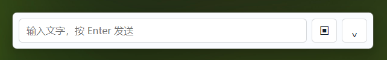
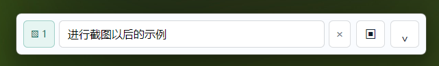
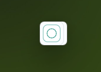
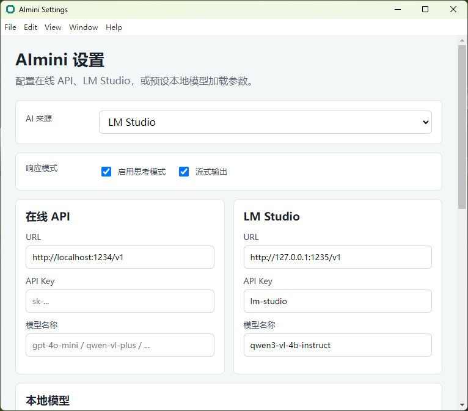

# AImini

## v0.2.0 Current Highlights

- Built-in Windows x64 CPU `llama-server` runtime based on llama.cpp.
- Built-in model loader for local `.gguf` models, without requiring LM Studio.
- Optional `mmproj` selection for local vision models and screenshot input.
- Real-time local model loading status, stop-model control, and llama-server logs.
- Automatic safe path handling for non-ASCII model directories.
- Screenshot input is resized before sending to reduce local vision-model latency.
- Local screenshot requests now warn early when `mmproj` is missing.
- Markdown and KaTeX rendering, conversation context, cache records, screenshot preview, and cache cleanup settings.

For GitHub Release text, see `RELEASE_NOTES_v0.2.0.md`.

## 中文说明

AImini 是一个面向 Windows 的轻量级桌面悬浮 AI 助手。它可以常驻在屏幕角落，支持文字提问、框选截图提问、多图输入、流式回复、历史记录、系统托盘控制，以及 LM Studio / OpenAI-compatible API 接入。

项目的目标是提供一个随时可用、不会打断当前工作流的桌面 AI 工具：需要时展开输入，不需要时自动收缩成一个小型可拖动按钮。

## 功能特性

- 桌面悬浮窗，支持置顶显示
- 空闲 8 秒后自动收缩为小型可拖动按钮
- 点击小按钮可快速展开输入栏
- 支持文字输入，按 Enter 快速发送
- 支持框选屏幕区域截图
- 支持添加多张截图后一起提问
- 支持流式输出，并在悬浮窗下方显示 3 行即时预览
- 回复结束 5 秒后自动收起预览区域
- 支持展开历史对话记录
- 支持系统托盘菜单：显示、隐藏、设置、退出
- 支持 LM Studio 本地服务
- 支持 OpenAI-compatible API
- 支持本地模型参数配置，包括模型路径、上下文窗口、GPU、GPU layers、offload、线程数、temperature 等
- 支持思考模式开关，并在关闭时尝试使用 `/no_think`、`enable_thinking=false` 等参数

## 界面预览

### 悬浮输入栏



### 添加截图后的输入状态



### 空闲自动收缩状态



### 设置页面



## 运行环境

- Windows 10 / Windows 11
- Node.js
- npm

## 本地运行

安装依赖：

```powershell
npm.cmd install
```

启动应用：

```powershell
npm.cmd start
```

如果不想显示命令行窗口，可以在 Windows 上双击：

```text
AImini.vbs
```

## 模型配置

启动应用后，可以从系统托盘图标右键菜单进入设置。

### 使用 LM Studio

1. 在 LM Studio 中启动本地 Server。
2. 确认服务地址，例如：

```text
http://127.0.0.1:1235/v1
```

3. 在 AImini 设置中选择 LM Studio。
4. 填写 URL、API Key 和模型名称。

模型名称需要与 LM Studio Server 暴露的模型 ID 一致。

### 使用在线 API

AImini 支持 OpenAI-compatible API。你需要填写：

- API URL
- API Key
- 模型名称

示例：

```text
https://api.example.com/v1
```

### 使用本地模型

本地模型设置页目前用于配置本地推理服务参数。你可以填写本地服务 URL、模型名称、启动命令、模型路径以及 GPU 相关参数。

如果本地推理服务兼容 OpenAI `/chat/completions` 接口，AImini 可以通过该接口进行调用。

## 打包

项目已配置 `electron-builder`。可以使用以下命令打包 Windows 版本：

```powershell
npm.cmd run dist
```

打包产物会生成在：

```text
dist/
```

推荐将生成的 `.exe` 上传到 GitHub Releases，而不是提交到代码仓库。

## 注意事项

- 当前项目主要面向 Windows。
- 截图功能基于 Electron / Windows 屏幕捕获能力。
- 部分 DRM 或硬件加速保护的视频内容可能无法被系统截图接口正常捕获。
- Qwen 等思考模型是否能完全关闭思考模式，取决于模型本身和运行后端是否正确支持相关参数。
- 对于 LM Studio，部分模型可能会返回 `reasoning_content`，AImini 会尽量只展示普通回复内容。

## 项目状态

AImini 目前处于早期原型阶段，适合个人使用、功能验证和二次开发。后续可以继续完善安装包、快捷键、自启动、截图兼容性、模型管理和 UI 细节。

---

## English

AImini is a lightweight floating desktop AI assistant for Windows. It stays in a screen corner and supports text prompts, selected-area screenshots, multiple image inputs, streaming responses, conversation history, system tray controls, and LM Studio / OpenAI-compatible API integration.

The goal of AImini is to provide an always-available AI tool that does not interrupt your current workflow. It expands when you need it and automatically collapses into a small draggable button when idle.

## Features

- Always-on-top floating desktop window
- Automatically collapses into a small draggable button after 8 seconds of inactivity
- Click the small button to restore the input bar
- Text input with Enter-to-send
- Selected-area screenshot capture
- Multiple screenshots in a single prompt
- Streaming responses with a 3-line live preview
- Auto-hide response preview 5 seconds after completion
- Expandable conversation history
- System tray menu: show, hide, settings, and quit
- LM Studio support
- OpenAI-compatible API support
- Local model runtime parameter settings, including model path, context size, GPU, GPU layers, offload, threads, and temperature
- Thinking-mode toggle with `/no_think`, `enable_thinking=false`, and related request parameters where supported

## Screenshots

### Floating Input Bar


### Input State with Screenshot


### Auto-Collapsed State


### Settings Page


## Requirements

- Windows 10 / Windows 11
- Node.js
- npm

## Run Locally

Install dependencies:

```powershell
npm.cmd install
```

Start the app:

```powershell
npm.cmd start
```

On Windows, double-click the following file to start the app without showing a command-line window:

```text
AImini.vbs
```

## Model Configuration

After launching AImini, open Settings from the system tray menu.

### LM Studio

1. Start the local server in LM Studio.
2. Confirm the server URL, for example:

```text
http://127.0.0.1:1235/v1
```

3. Select LM Studio in AImini settings.
4. Fill in the URL, API key, and model name.

The model name must match the model ID exposed by the LM Studio server.

### Online APIs

AImini supports OpenAI-compatible APIs. You need to provide:

- API URL
- API key
- Model name

Example:

```text
https://api.example.com/v1
```

### Local Models

The local model settings page is used to configure local inference service parameters, including server URL, model name, launch command, model path, and GPU-related settings.

If your local runtime exposes an OpenAI-compatible `/chat/completions` endpoint, AImini can call it directly.

## Build

This project is configured with `electron-builder`. To build a Windows executable:

```powershell
npm.cmd run dist
```

Build artifacts will be generated in:

```text
dist/
```

It is recommended to upload the generated `.exe` to GitHub Releases instead of committing it to the repository.

## Notes

- AImini currently targets Windows.
- Screenshot capture is based on Electron and Windows screen capture behavior.
- Some DRM-protected or hardware-accelerated video content may not be captured correctly by the operating system.
- Whether thinking mode can be fully disabled for models such as Qwen depends on both the model and the runtime backend.
- Some LM Studio models may return `reasoning_content`; AImini attempts to display only the normal response content.

## Project Status

AImini is currently an early prototype. It is suitable for personal use, feature validation, and further development. Future improvements may include a polished installer, global shortcuts, auto-start, better screenshot compatibility, model management, and UI refinements.
